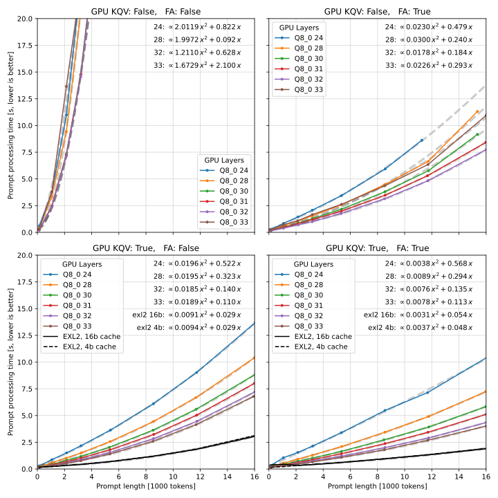
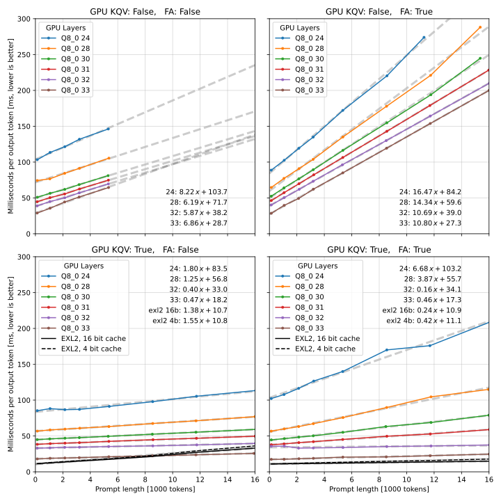
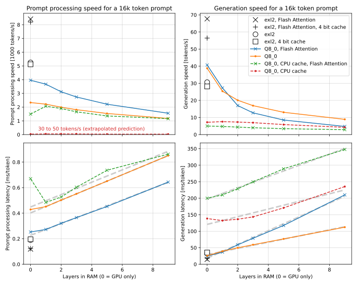

# llama-cpp-speed-measurements
Performance measurements of llama.cpp and exllamav2 on my machine. So **all results and statements here apply to my PC only** and applicability to other setups will vary. Not only speed values, but the whole **trends** may vary GREATLY with hardware. As in, maybe on your machine llama.cpp will be much faster than exllamav2, or maybe FA will slow down exl2, or maybe FA will speed up lcpp's generation.

My specs: Linux, Nvidia RTX 4090, 10700k, dual channel 3200 MT/s DDR4 RAM, XMP enabled.

My results might be applicable to other systems with a fast RTX GPU and a less fast CPU & RAM. If you have faster RAM, or a faster CPU, or a slower GPU, your results could differ a lot. Could also differ on other operating systems, and may change with future software updates and optimizations. And I'm sure it's different for AMD or Intel cards.

# General Methodology
I used [oobabooga's Text Generation WebUI](https://github.com/oobabooga/text-generation-webui)'s API to measure speed. ([Why?](#generation-methods))
I used two models: [bartowski/Meta-Llama-3-8B-Instruct-GGUF Q8_0](https://huggingface.co/bartowski/Meta-Llama-3-8B-Instruct-GGUF) and [bartowski/Meta-Llama-3-8B-Instruct-exl2 8 bpw](https://huggingface.co/bartowski/Meta-Llama-3-8B-Instruct-exl2).

~~Here are the library versions I used: [link to commit.](https://github.com/oobabooga/text-generation-webui/blob/bd7cc4234d0d2cc890c5e023f67741615c44484a/requirements.txt)~~

Following a suggestion, I updated to [this commit](https://github.com/oobabooga/text-generation-webui/blob/9420973/requirements.txt) which resulted in speedups for exl2 with **no** Flash Attention, but no other changes and no new conclusions. I only repeated the exl2 measurements as re-doing the 32 data points takes 5 minutes, vs many hours for the 300+ GGUF data points. Partially because lcpp is slower, partially because it's less consistent and I need to re-do same measurement 5 or more times, and mostly because there's more settings I varied with lcpp.

Under the hood, WebUI used [exllamav2](https://github.com/turboderp/exllamav2) and **exl2** files, and [llama-cpp-python](https://github.com/abetlen/llama-cpp-python), which in turn uses [llama.cpp](https://github.com/ggerganov/llama.cpp/) and **GGUF** files.

I measured prompt processing and token generation speed:
- with and without flash attention,
- (GGUF only) with and without offloading KQV cache to GPU,
- (GGUF only) with varied number of model layers offloaded to GPU: using Llama-3-8B, 33 layers on GPU = full offload, fastest, highest VRAM use,
- (exl2 only) 4 bit or 16 bit KQV cache.

# Prompt processing speed
Total time of processing a prompt of a given length vs the prompt length.

## Main conclusions:
- Llama.cpp processes long prompts _extremely slowly_ with no Flash Attention and KQV cache in RAM.
- Offloading more layers to GPU speeds up processing unless the KQV is on CPU and you offload all layers - that causes slower processing than leaving one layer in RAM.
- Exllamav2 processes prompts significantly faster than llama.cpp, even at full GPU offload.
- Flash Attention speeds up processing in all cases, for KQV on CPU and long prompts by around _two orders of magnitude._
- For KQV on GPU, FA causes prompt processing speed vs prompt length to _almost_ lose the quadratic component.

# Generation speed
Latency (inverse of speed), in milliseconds per token, when generating a 256-token response for a given prompt length.

## Main conclusions:
- For llama.cpp, Flash Attention **slows down** generation speed, in some cases significantly. Except: if KV cache and almost all layers are in VRAM, it might offer a tiny speedup.
- For exllamav2, Flash Attention significantly speeds it up.
- With FA, exl2 is much faster than llama.cpp, even at full GPU offload.
- Without FA, exl2 can be slower than llama.cpp for long prompts, but in exl2's case using FA does not have a single downside I could notice.
- Exl2's optional cache quantization slightly slows down generation speed.

# Speed vs layers offloaded to GPU
A vertical slice through the same data as above, but only for 16k prompt length, to show how speed varies with the number of layers offloaded to GPU. Zero layers means the whole model is in VRAM.

- **Left** column: prompt processing.
- **Right** column: token generation.
- **Top** row: speed in tokens per second.
- **Bottom** row: the inverse of the same data in milliseconds per token.

Since the data is the same, there are no new significant observations, but here it's clearer how in the case of longer prompts FA and other factors influence the speed and how much faster Exllamav2 can be.

# Flash Attention slows down llama.cpp?!
That's my experience! I don't know why. With Exl2, it seems using FA has no downsides. With llama.cpp it speeds up prompt processing a lot. Without it, it can be a nightmare with KQV cache on CPU. But it slows down token generation **on my PC.** Maybe this isn't the case on other hardware?

I wish I knew why. As a dirty fix, would it be possible to add an option to llama.cpp to process prompts with FA, then for token generation not use FA? I don't know if that makes sense.

# Details
## But what about different quants?!
I tested `IQ2_XXS`, `IQ4_NL`, `Q4_K_S`, and `Q8_0`. **On my PC** the speed differences between these are very small, not interesting at all to talk about. Smaller quants are slightly faster. "I-Quants" have practically the same speed as "non-I Quants" of the same size.

## Raw Data
In `.csv` files in the repo.

## Code?!
In `.py` files in the repo. Requires running oobabooga's WebUI or a compatible backend.

## Model parameters
```py
# GGUF
{
    "flash_attn": flash_attn,
    "loader": "llamacpp_HF",
    "n_batch": 512,
    "n_ctx": 16 * 1024,
    "n_gpu_layers": n_gpu_layers,
    "no_offload_kqv": no_offload_kqv,
    "rope_freq_base": 500000,
    "tensorcores": True,
}
# EXL2
{
    "no_flash_attn": not flash_attn,
    "loader": "ExLlamav2_HF",
    "cache_4bit": cache_4bit,
    "max_seq_len": 16 * 1024,
}
```

## Generation parameters
```py
{
    "add_bos_token": False,
    "ban_eos_token": True,
    "do_sample": False,
    "max_tokens": max_tokens,
    "prompt": prompt,
    "seed": 123,
    "skip_special_tokens": False,
    "stop": [],
    "stream": False,
}
```

## Prompt generation
For every desired prompt length, I would generate a list of random integers in the range of the tokenizer's entire vocabulary length, detokenize this, and use that gibberish as prompt. Re-tokenizing that gibberish resulted in slightly different prompt lengths. I used the prompt lengths reported by the WebUI in my calculations and plots.

## Time measurements
I would load a model, generate 1 token from a 1-token prompt (as a crude attempt to lower overhead), generate 1 token from the desired prompt - this processes prompt and caches the result, then generate 256 tokens from the same cached prompt so it wouldn't be re-processed. I measured the time of each operation.

I would repeat the tests many times and record only the fastest speed for each unique parameter set. CPU-involved generation is much less reliable in speed than GPU-only and the speed tends to vary run-to-run.

## Generation methods
### Measuring llama-cpp-python's execution time
This worked great except I could not figure out why was there a significant overhead in every single generation request. Extra 3 to 10 seconds compared to the WebUI API. After spending hours trying and failing to remove it, I considered other options.
### Using llama-cpp-python's verbose mode
With the `verbose` flag, the module outputs detailed speed statistics. They separated this mysterious overhead into its own category, and reported prompt processing and token generation speed separately. Great! I thought, but... The reported speeds are much faster than what I experience in practice when using the same library via the WebUI, and the overhead persists.

I think these self-reported numbers may reflect well the performance of inner algorithms used by llama.cpp, but they may not reflect what users of this library will experience - with the overhead and all.
### WebUI
Hence, I settled on the WebUI. This is also how I normally use llama.cpp, thus the results directly represent my experience.
